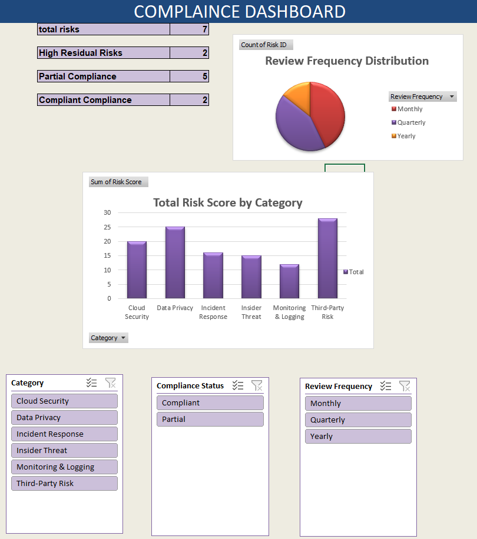
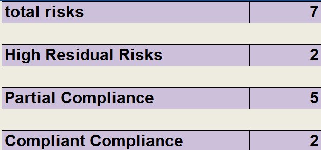
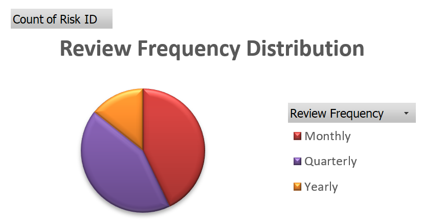
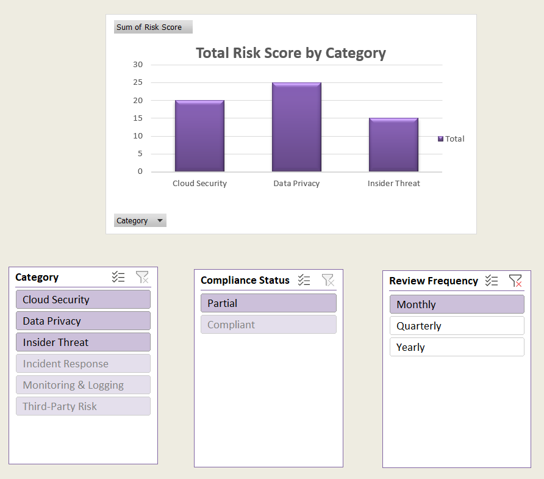

# Cyber Risk & Compliance Project – India

A simulated end-to-end Governance, Risk & Compliance (GRC) assessment for a fictional Indian fintech startup, PayNex FinTech Pvt. Ltd. This project aligns with real-world cybersecurity frameworks and regulations, including:

- ISO/IEC 27001:2022
- NIST Cybersecurity Framework
- India's Digital Personal Data Protection (DPDP) Act 2023
- RBI Cyber Security Framework

## 📁 Project Structure

- `company-profile.md` – Overview of the simulated organization
- `risk-register-with-policy-mapping.xlsx` – Identified risks with policy mappings
- `compliance-dashboard.xlsx` – Visual dashboard of risk statuses
- `dpdp-gap-analysis.md` – Assessment against DPDP Act requirements
- `iso27001-nist-mapping.md` – Mapping between ISO 27001 and NIST CSF controls
- `executive-report.pdf` – Summary report for executive stakeholders
- `risk-heatmap.png` – Visual representation of risk severity
- `policies/` – Directory containing policy documents:
  - `data-protection-policy.md`
  - `cloud-security-policy.md`
  - `incident-response-policy.md`

## 📌 Key Highlights

- **Risks Identified**: Seven major simulated risks across critical domains including cloud security, data protection, and incident response, with detailed mitigation strategies
- **Compliance Status**:
  - ISO/NIST: Achieved 70% alignment with combined ISO 27001 and NIST CSF controls, indicating a strong baseline security posture.
  - DPDP Act:  Demonstrated 75% compliance with the stringent requirements of the Digital Personal Data Protection Act 2023, highlighting key areas for improvement.
- **Policy Framework**: Comprehensive policies covering critical security domains.
- **Visual Tools**: Utilization of an interactive compliance dashboard and a clear risk heatmap for intuitive monitoring and reporting of GRC metrics.

## 📊 Dashboard & Visuals Showcase
Explore the key insights and interactive elements of this project through the following visuals:

**Compliance Dashboard Overview**
A high-level view of the interactive Excel dashboard, presenting aggregated KPIs, compliance status distribution, and risk scores by category.

  

**Key Performance Indicators (KPIs)**
A closer look at the summary KPIs that provide a real-time pulse on the GRC posture.

  

**Risk Status & Compliance Distribution**
Visual breakdowns illustrating the current state of compliance across different categories and the distribution of identified risks.

  

  

**Interactive Filtering in Action**
Demonstrates how the dashboard's slicers allow for dynamic filtering and exploration of data, providing granular insights into specific risk areas or compliance statuses.

  

## 📈 Next Steps

- Address identified gaps in DPDP compliance, focusing on data minimization and grievance redressal.
- Implement missing controls to reduce residual risks.
- Regularly update the compliance dashboard to reflect changes.

## 📬 Contact

For more information or collaboration opportunities, please reach out via GitHub issues or pull requests.
